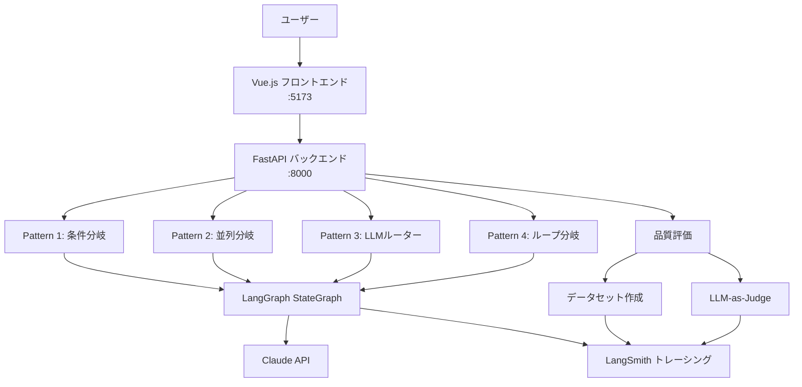

# LangGraph 分岐パターン学習

LangGraph の4つのグラフ分岐パターンを実装・可視化し、LangSmith で品質評価を行う学習プロジェクト。

## 概要

LangGraph の分岐処理パターンを学び、各パターンの動作を Web UI で確認。
LangSmith 連携により、グラフの実行トレース・判断理由の可視化・ユースケース品質評価ができる。

### 4つの分岐パターン

| # | パターン | グラフ構造 | ユースケース |
|---|---------|-----------|-------------|
| 1 | 条件分岐 (Conditional) | 感情分析 → 3方向分岐 | カスタマーサポート振り分け |
| 2 | 並列分岐 (Fan-out/Fan-in) | 3つの分析を並列実行→統合 | コンテンツ分析パイプライン |
| 3 | LLMルーター | LLM判定 → 専門エージェント | インテリジェントFAQ |
| 4 | ループ付き分岐 | 生成→評価→改善ループ | 文章品質改善エージェント |

## フロー図



## ローカル環境構築手順

### 前提条件

- Docker / Docker Compose
- Anthropic API Key

### 1. 環境変数設定

`.env` に以下を設定:

```env
ANTHROPIC_API_KEY=your-api-key

# LangSmith（任意、品質評価機能を使う場合）
LANGCHAIN_TRACING_V2=true
LANGCHAIN_API_KEY=your-langsmith-api-key
LANGCHAIN_PROJECT=langchain-study
```

### 2. 起動

```bash
docker compose up --build
```

### 3. アクセス

- フロントエンド: http://localhost:5173
- API (Swagger): http://localhost:8000/docs

## 本番デプロイ手順

（未実装 - ローカル動作確認後に CDK で構築予定）
